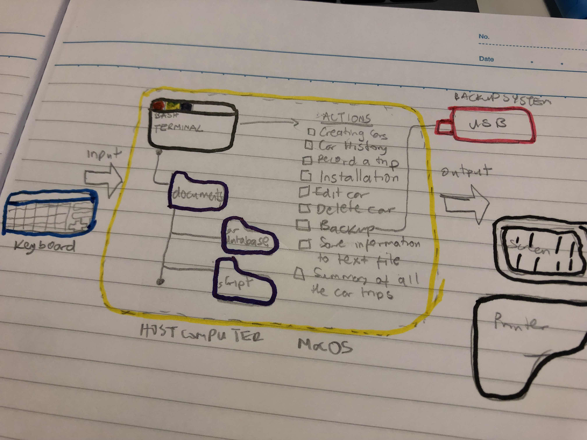

Car Rental Minimal App
===========================

A car rental management minimal app in Bash.

Contents
-----
  1. [Planning](#planning)
  1. [Design](#design)
  1. [Development](#development)
  1. [Evalution](#evaluation)

Planning
----------
### Definition of the problem
 The new system is supposed to be simple to handle, easy to understand, be able to carry out its required functions (create a car, record a trip, edit and delete a car etc). The new system should be able to save and record all its information. 
The installation of the new system should be easy and clear. For example, we can download the file from a link or copy the file from a USB drive. Assuming the owner of the shop was using a previous system, there are a variety of ways we can go about the process of installing a new system. They are: direct changeover, parallel running, pilot running and phased conversion.
A feasibility study must be carried out before installation to know whether or not the new system will come off. It is like a possibility study which asks the question “Is this system possible to achieve?”  If the system seems possible, the implementation of the system is then planned out. 
After this, the components of the computer system must also be made familiar with the system (eg. training the users). The information also must be backed up by another system or device to prevent data loss. 
### Proposed solution
I am going to use bash to create the program. I feel it is the most suitable solution because the user wants simple installation and bash is already incorporated in the operating system. Therefore, there is not much need to download a program. I guess bash is also less prone to hackers because it is quite an old programming system so most people are not really familiar with the commands. It also carries out the fuctions of 
### Success Criteria
These are outcomes that can be measured
1. A car can be created 
1. A trip can be recorded for a given car
1. A summary (total distance travel, average) of trips can be measured
1. A car information can be edited
1. A basic working backup system is available
1. The user can easily (name notation, documentation) understand the commands
1. Installation is **simple**, it does not require additional software, one step process
!. A car information can be deleted
1. The application can be uninstalled

Design
---------
### First Sketch of System

**Fig. 1** This diagram shows the main components of the minimal rental app. It includes the input/outputs and main actions.

## Flow diagrams 

### Flow diagram for creating a frame in the Bash terminal

***Fig. 2** This flow diagram shows the algorithm for creating a frame with a word inside in the bash terminal.

### Test Plan
|                                  |                                                                          |                                                                                                      |       |
|----------------------------------|--------------------------------------------------------------------------|------------------------------------------------------------------------------------------------------|-------|
| ACTION                           | INPUT                                                                    | OUTPUT                                                                                               | CHECK |
| Install                          | ---------                                                                | Folder is created with all the files inside.                                                         |     O  |
| Uninstall                        | ---------                                                                | Folder is deleted with all the car files inside.                                                     |      O |
| Create                           | Car information (eg. JIK777 Ford black 5)Bash create.sh JIK777 Ford black 5 | The file JIK777.txt is created, maincarfile is updated with the car information JIK777 Ford black 5  |     O  |
| Record                           | Car’s license number and distance travelledBash record.sh JIK777 100km      | The trip of the car is recorded and the maincarfile is updated with the distance travelled eg. 100km |      O |
| Edit                             | Car’s license number bash edit.sh JIK777 Ford black 5                                    | The required information of the car is edited and updated.                                           |      X |
| Summary                          | Car’s license number bash summary.sh JIK777                                        | It shows a summary of the total distance travelled by car.                                           |     O  |
| Delete                           | Car’s license numberBash bash delete JIK777 Ford black 5                      | The file JIK77.txt is deleted, and all of its contents.                                              |    O   |
| User can understand the commands | Bash program:man create                                                  | A text showing all the commands and their various uses in different aspects.                         |      O |

Development
--------
### 1. Script for installation
```.sh
#!/bin/bash

#This program creates the folder structure for the minimal rental app

echo "Starting installation"
echo "Installing in the desktop (default). Press enter"
read
cd ~/Desktop

#create app folder
mkdir RentalCarApp

cd RentalCarApp
mkdir database
mkdir scripts
echo "Installation complete successfully"
F
This script meets the requirement of the client for a simple installation
however, it could be simplified so that the user does not need to
execute the program by typing ``bash install.sh``

1 How to detedct is a word's length is odd or even
```.sh
  if [ $len%2 -eq 0 ]
```
### How to create an unistall program
```.sh
#!/bin/bash

#this program will delete the created folders for the minimal rental app

echo "Starting to uninstall"
echo "uninstalling in the desktop (default). press enter"
read
cd ~/Desktop

rm -r RentalCarApp


echo "uninstallation complete successfully"
```

### Developing the action Create new car
This process involves the inputs _,_,_,_, and the outputs:
The following steps describe the algorithm
① Get the inputs as arguments '$1 $2 $3 $4'
② Check number of arguments. In bash this can be done as 'if [$# -eq 4]
③ Store new car inside maincarfile.txt. echo "Lx9/2 nissan 2000 8" >>maincarfile.txt
④ Create file for recording tips as plate.txt. echo "" > plate.txt
```.sh
#!/bin/bash

#This program creates a car given four arguments
#License Maker Model Passengers

if [ $# -ne 4 ]; then
	echo "Error with the number of arguments"
	echo "Enter License Maker Model Passengers"
	exit
fi

#number of arguments is correct, continue
license=$1
maker=$2
model=$3
pp=$4

#this creates a new line in the file maincarfile.txt inside CarRentalApp
echo "$license $maker $model $pp" >> ../Database/maincarfile.txt
echo "" > ../Database/$license.txt

bash frame.sh "Installation Completed"
```

### Developing action record
This process records the trip.
The following steps decribe the algorithm
① Get the arguments (2) and check
② Check that the car exist
③ add a new line to the file license.txt
④ end
```.sh
#!/bin/bash

# This program records the trips of each car
# License Distance

if [ $# -ne 2 ]; then
    echo "Error with the number of arguments"
    echo "Enter License Maker Model Passengers"
    exit
fi

# Number of arguments are correct, continue
license=$1
distance=$2

# Check if file exists
if [ ! -f ~/desktop/RentalCarApp/dataBase/"$license.txt" ]; then
    echo "Car does not exist"
    exit
fi

# Adding the trip to the file for the car
echo "$distance" >> ~/desktop/RentalCarApp/dataBase/$license.txt


bash frame.sh "Trip recorded successfully"
```

### Developing the action edit
This process edits information about a car.
The following steps describe the algorithm
①　Get the argument and check
②　Check if the car exists
③ edit the info of the car as desired.
④ save and store information
```.sh
#!/bin/bash
#This program edit the information of an exiting car in the
#maincarfile
#user enters [license place] [model] [red] [pp]

if [ $# -ne 4 ]; then
  echo "Error with the number of arguments"
  echo "Enter License Maker Model Passengers Color"
  exit
fi

license=$1
maker=$2
model=$3
pp=$4

cd ../Database

if [ ! -f "$license.txt" ]; then
  echo "File not found!"
fi

#find the line with the given car plate and delete it
sed -i '' "/^$license/d" maincarfile.txt
#add the new information
echo "$license $maker $model $pp" >> maincarfile.txt
cd ../scripts
bash frame.sh "Car edited successfully"
```

### Developing the action summary
This gives us a summary on the total distance traveelled by a car.
```.sh
#!/bin/bash
#This program summarizes the total distance traveled by a car.

total=0

#Read through the car's file
FILE="../Database/$1.txt"
while read line
do
  #Bash splits a line by spaces
  for word in $line
  do
    km=$word
#Calculate the total distance traveled
    (( total=$total + $km ))
    break
  done
done < $FILE

#Print the car's file
echo "Trips:"
cd ../Database/
cat $1.txt

#Print the car's total distance travelled
echo "Total distance travelled:" $total "km"
```

### Developing the action back-up
Backup is the process of copying or archiving files and folders for the purpose of being able to restore them in case of data loss. Data loss can be caused by many things such as computer viruses, hardware failures, file corruption, human error and natural disasters. Below, is a program to show how to back up to a USB or the desktop.
```.sh
#!/bin/bash

# This program creates a backup of the database folder in the app folder
# Either backs up to the desktop, or to an USB stick

# Starting
echo "Backup starting"

##### Save to the desktop
# Navigate to the desktop to create a new folder (backup/)
cd ~/desktop/
# If theres already a folder called "backup", it is removed
rm -r backup
mkdir backup
# Creats subfolder (backup/dataBase/)
cd backup
mkdir dataBase

# Copies all (*) the files from the dataBase folder 
# to the new folder (backup/) and subfolder (backup/dataBase/)
cp ~/desktop/RentalCarApp/dataBase/* ~/desktop/backup/dataBase/

### NOT NECESSARY, ONLY FOR AESTHETIC PURPOSES
# Prints the frame
# Navigates to the folder of the frame.sh script
cd ~/Desktop/RentalCarApp/scripts/
bash frame.sh "Installation complete"


##### Save to a usb stick
# MULTILINE COMMENT
: '
echo -n "What is your USB stick called? "
read usbName

cd /Volumes/%usbName/
# If theres already a folder called "backup", it is removed
rm -r backup
mkdir backup
# Creats subfolder (backup/dataBase/)
cd backup
mkdir dataBase

# Copy files to USB stick
cp ~/desktop/RentalCarApp/dataBase/* /Volumes/$usbName/backup/dataBase/

' # MULTILINE COMMENT
```

### Developing the action delete
This allows us to delete all information about a car.
```.sh
#!/bin/bash 

#this program delete a car given one argument
#licences 

if [ $# -ne 1 ]; then rm -rf 
	echo "error with the number of arguments"
	echo " enter license"
	exit 
fi 

#number of the arguments is correct, continue 
license=$1

#this delete an existing file maincarfile.txt inside CarRentalApp 
echo "$license" > db/maincarfile.txt

bash frame.sh "car deleted successufully"
```

### 3. Developing user help files
We use man page protocol to display the user manual of any command that we can run on the terminal. It provides a detailed view of the command which includes NAME, SYNOPSIS, DESCRIPTION, OPTIONS, EXIT STATUS, RETURN VALUES, ERRORS, FILES, VERSIONS, EXAMPLES, AUTHORS.(adapted from GeeksforGeeks.com)
https://www.cyberciti.biz/faq/linux-unix-creating-a-manpage/
The website above gives more explanation about man files.

```.sh
.TH man 6 "29 Oct 2019" "1.0" "create man page"
.SH NAME
create \- Creates a new car
-SH SYNOPSIS
bash create.sh [license] [maker] [model] [passengers]
.SH DESCRIPTION
create is a bash program that allows to create a new car in the database
.SH AUTHOR
Okechukwu Chinomnso
```

```.sh
#!/bin/bash

.TH man 6 "01 Nov 2019 1.0" "delete man page"
.SH NAME
delete \- Deletes an existing car
-SH SYNOPSIS
bash delete.sh [license] [maker] [model] [passengers]
.SH DESCRIPTION
delete is a bash program that allows to delete an existing car in the database
.SH AUTHOR
Okechukwu Chinomnso
```

During the course of uploading my test plan, I learnt about mark down tables and how to convert to mark down tables from csv files.

Evaluation
-----------
#!/bin/bash

#This file checks if the action create successfully adds a new car.

#Step 1: navigate to the folder containing the create.sh file
cd ../scripts/
if [ -f "create.sh" ]; then (this is used to check the existence of a file)
        echo "File exists, test will start now"
else
        echo "File create.sh does not exist. Test Failed"
fi

#Step 2: Use the create script to record a new car TXM901 nissan red 9
bash create TXM901 nissan red 9

#Step 3: Check that a txt file was created inside the database folder with
#the license numbver
if [ -f "TXM901.txt" ]; then (this is used to check the existence of a file)
        echo "Test one: file with the license plate created successfully. Passed"
else
        echo "Test one: file with license number not found: Failing"
fi
```

Here the option -f in the if condition checks for a file in the working folder.

This corresponds to dynamic testing as opposed to static testing. It also corresponds to alpha testing because we are the ones developing the Car Rental App. It also corresponds to white-box testing because we had to go inside and check everything. The system meets the expecations of its users. 


